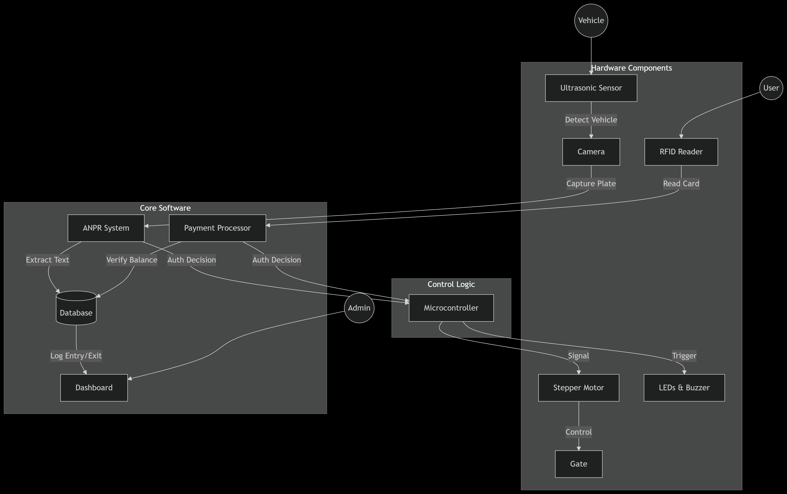

# 🚗 Parking Management System

<div align="center">


</div>

A computer vision-based parking management system that uses license plate recognition for vehicle entry and exit management.

## System Architecture



## Features

- **License Plate Detection**: Uses YOLOv8 for real-time license plate detection
- **OCR Processing**: Tesseract OCR for accurate plate number recognition
- **Entry Management**:
  - Automatic vehicle entry logging
  - CSV-based logging system
  - Real-time entry status display
- **Exit Management**:
  - Payment verification before exit
  - Automatic gate control
  - Unauthorized exit detection
- **Dashboard**:
  - Real-time vehicle status monitoring
  - Payment status tracking
  - Daily statistics (entries, exits, revenue)
  - CSV-based data display

## Recent Updates

- Switched to CSV-first approach for data management
- Improved exit system reliability
- Enhanced dashboard with direct CSV reading
- Better handling of payment status verification
- Simplified data flow and reduced complexity

## Requirements

- Python 3.8+
- OpenCV
- YOLOv8
- Tesseract OCR
- Flask
- Arduino (for gate control)

## Installation

1. Clone the repository:

```bash
git clone https://github.com/Nbruchi/parking-management-system.git
cd parking-management-system
```

2. Install Python dependencies:

```bash
pip install -r requirements.txt
```

3. Install Tesseract OCR:

- Windows: Download and install from [Tesseract GitHub](https://github.com/UB-Mannheim/tesseract/wiki)
- Linux: `sudo apt-get install tesseract-ocr`

4. Download YOLOv8 model:

- Place the trained model (`best.pt`) in the project root directory

## Usage

1. Start the entry system:

```bash
python entry.py
```

2. Start the exit system:

```bash
python exit.py
```

3. Launch the dashboard:

```bash
cd dashboard
flask run
```

## Data Management

The system uses a CSV-based approach for data logging:

- All vehicle entries and exits are logged in `plates_log.csv`
- Format: `Plate Number,Payment Status,Timestamp,Payment Timestamp`
- Dashboard reads directly from CSV for real-time updates
- No database synchronization required

## File Structure

```
parking-management-system/
├── entry.py              # Vehicle entry system
├── exit.py              # Vehicle exit system
├── dashboard/           # Web dashboard
│   ├── app.py          # Dashboard application
│   └── templates/      # HTML templates
├── plates_log.csv      # Vehicle log data
├── best.pt            # YOLOv8 model
├── requirements.txt    # Python dependencies
└── visuals/           # System diagrams and visuals
    └── system-architecture.png
```

## Contributing

1. Fork the repository
2. Create your feature branch (`git checkout -b feature/AmazingFeature`)
3. Commit your changes (`git commit -m 'Add some AmazingFeature'`)
4. Push to the branch (`git push origin feature/AmazingFeature`)
5. Open a Pull Request

## License

This project is licensed under the MIT License - see the LICENSE file for details.

---

<div align="center">
Made with ❤️ by Bruce NKUNDABAGENZI
</div>
